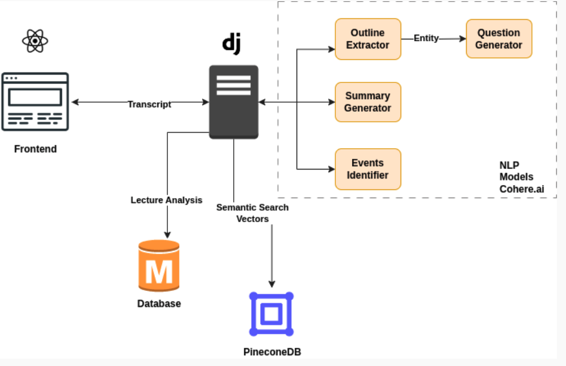
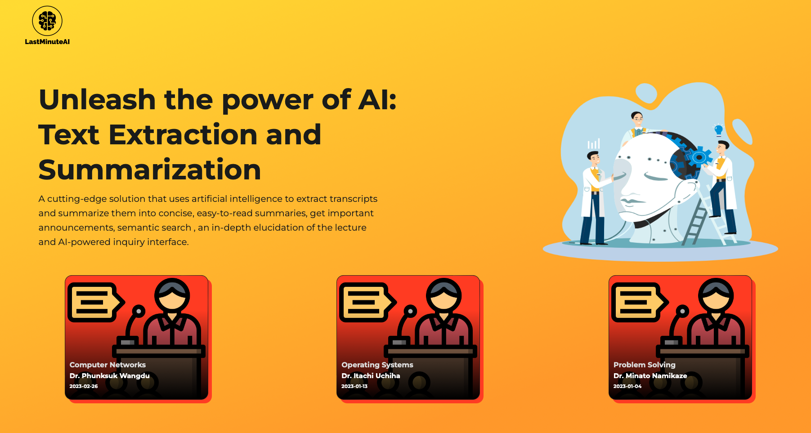
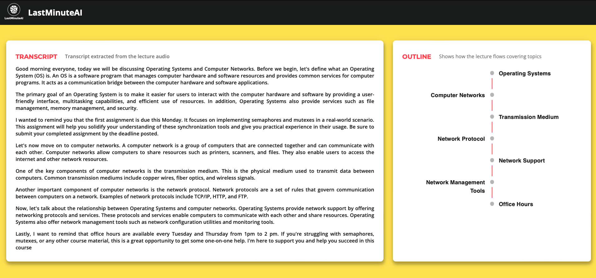
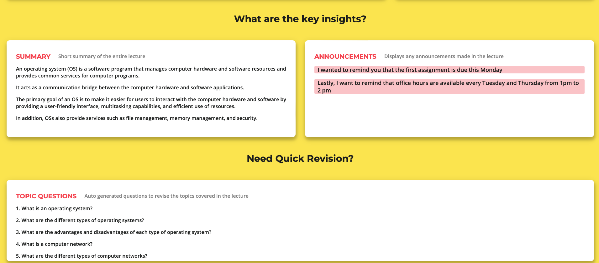

# [LastMinuteAI](https://lastminuteai.netlify.app)
<a></a>
<a></a>
<a></a>
<a></a>
<a></a>

## Inspiration

As students, we've always struggled to catch up on lectures that we've missed. The thought of going through hours of recorded lectures seemed daunting and time-consuming. LastMinute summarizes the lecture content and extracts outline, announcements, and quiz questions.

## Features

**_Summarization_**: Generate a summary of the lecture, providing an overview of the key points discussed.   
**_Announcement Extraction_**: Extract important announcements made during the lecture, providing relevant information to students who missed the lecture.   
**_Outline_**: Provide an outline of the lecture, allowing students to easily navigate the content.  
**_Quiz Generation_**: Generate a quiz based on the lecture, testing students' understanding and knowledge.  

## Usage

```
pip install -r requirements.txt
```

## Architecture



## [UI](https://github.com/saintlyzero/brick-hack-ui/tree/main/src)





